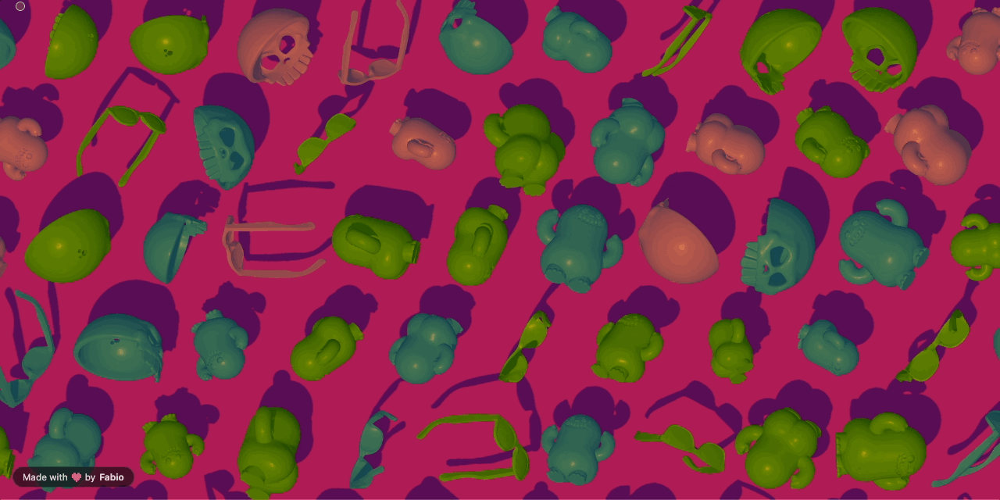

# threejs-shadow-grid

[](https://www.npmjs.com/package/threejs-shadow-grid)
[](https://github.com/FabioGA/threejs-shadow-grid/actions/workflows/ci.yml)
[](https://www.typescriptlang.org)
[](./LICENSE)

<p align="center">
  
</p>

<p align="center">
  <strong>A configurable, infinitely-tiling grid of 3D objects for site backgrounds — framework-agnostic, built on <a href="https://threejs.org">Three.js</a>, with a shadow that follows the mouse.</strong>
</p>

<p align="center">
  <a href="https://fabioga.github.io/threejs-shadow-grid/examples/demo.html">
    
  </a>
</p>

Drop in one or more STL or GLTF/GLB models; the library tiles them to completely fill whatever container you give it, and lights them with a single shadow-casting light that follows the mouse (or sweeps automatically on touch devices), so the shadows shift as people move their cursor around the page. Choose between a "sun" (parallel, uniform shadows) or a "cursor" light that hovers right over the pointer, casting shadows that genuinely vary per object based on distance.

It's framework-agnostic - a plain TypeScript class with no React/Vue/etc dependency - so it drops into any site.

The live demo above includes a full config playground (every option below as a live control, with a generated-code panel) - no install needed to try it. To run it from source instead: `npm run build && npx http-server . -p 8080`, then open `examples/demo.html`.

## Install

```bash
npm install threejs-shadow-grid three
```

`three` is a peer dependency (`>=0.150.0`) - install it alongside so your bundler dedupes a single copy.

## Quick example

```html
<div id="bg" style="position: fixed; inset: 0; z-index: -1;"></div>
```

```ts
import { ShadowGrid } from "threejs-shadow-grid";

const grid = new ShadowGrid({
  container: "#bg", // element or CSS selector
  models: "/models/logo-mark.stl",
  cellSize: 220, // px between object centers
  objectSize: 100, // px, each model's largest dimension
  colors: "#8fb8ff",
  backgroundColor: "#0a0a0f",
  light: "medium",
});

// later, e.g. on route change / unmount:
grid.destroy();
```

The wrapper div is given `position: fixed; inset: 0` in your own CSS - that's what makes it a pinned, full-viewport background that stays in place while the rest of the page scrolls over it (`z-index: -1` keeps it behind your content). The library itself only cares about filling *that* element; how you position the element on the page is ordinary CSS, which keeps the library unopinionated about your layout.

### Using with React

There's no React wrapper package (by design - the library is deliberately framework-agnostic), but wrapping it is a few lines:

```tsx
function ShadowGridBackground(props: GridConfig) {
  const ref = useRef<HTMLDivElement>(null);
  useEffect(() => {
    if (!ref.current) return;
    const grid = new ShadowGrid({ ...props, container: ref.current });
    return () => grid.destroy();
  }, []);
  return <div ref={ref} style={{ position: "absolute", inset: 0 }} />;
}
```

## Features

- **Full-bleed, auto-filling grid** - fills its container completely and re-fills automatically on resize (auto-computed columns/rows based on a cell size you set, not a fixed count). [See it live →](https://fabioga.github.io/threejs-shadow-grid/examples/demo.html#hero-section)
- **Full-page background or a contained box** - the same class either pins behind the whole page or fills a smaller panel/card; either way the grid stays full-bleed while page/container content scrolls over it. [Contained-box example →](https://fabioga.github.io/threejs-shadow-grid/examples/demo.html#box-section)
- **Mouse-driven shadow** - a single light follows the pointer. On touch devices (or before the first pointer move) it drifts naturally between randomized waypoints instead of sitting static or looping a fixed path.
- **Two light types** - a "sun" (parallel rays, every shadow the same length/direction) or a "cursor" light hovering directly over the pointer (shadows genuinely vary per object based on distance to it) - see [Light](#light).
- **Three simplified light presets** (`soft` / `medium` / `hard`) plus a continuous `hardness` knob, so you never have to touch raw Three.js lighting values.
- **Physically-based material** from soft matte rubber to hard, glossy, and reflective, dialed with a single `hardness` knob.
- **Grid or randomized arrangement**, independent per-axis rotation and size controls (fixed or randomized), and per-row horizontal offset for brick/masonry/cascade layouts.
- **STL and GLTF/GLB models, freely mixed** - a GLTF model keeps its own baked material(s)/textures by default, or renders flat-colored via a per-model `color` override.
- **Weighted color palettes and weighted model mixing** - exact proportional splits (e.g. 70/30), not just a per-object dice roll.
- **Ships as ESM + CJS + full TypeScript types.**

## Gallery

The same `ShadowGrid` class, three different looks - all from the live demo linked above.

### Full-page background

The effect shown in the hero at the top of this page: a fixed full-viewport background with the config from the [Quick example](#quick-example) above. [Live →](https://fabioga.github.io/threejs-shadow-grid/examples/demo.html#hero-section)

### Contained box (e.g. a hero panel, a card)

```html
<div id="hero-visual" style="position: relative; width: 100%; height: 480px; overflow: hidden;"></div>
```

```ts
new ShadowGrid({
  container: "#hero-visual",
  models: ["/models/a.stl", "/models/b.stl"],
  arrangement: "random",
  jitter: 0.5,
  colors: ["#ff9d5c", "#ff5c8a", "#5cc8ff"],
  light: "hard",
});
```

Same class, same API - it just fills whatever box you give it. If that box scrolls internally (`overflow: auto`) the grid stays put behind the scrolling content, the same way the full-page recipe does. [Live →](https://fabioga.github.io/threejs-shadow-grid/examples/demo.html#box-section)

### Matching an exact background color

`backgroundColor` normally paints a backdrop plane that's *lit* by the scene's own light, so its rendered shade shifts as the shadow moves and won't sit at an exact hex value. To match a precise color (e.g. copied from another site's CSS), set the color as a normal CSS `background-color` on the container and pass `backgroundColor: "transparent"` instead - the grid then only draws a shadow-only backdrop that darkens your CSS background where shadowed, leaving the rest exactly as you set it:

```html
<div id="bg" style="position: fixed; inset: 0; z-index: -1; background-color: rgb(23, 39, 19);"></div>
```

```ts
new ShadowGrid({
  container: "#bg",
  models: "/models/logo-mark.stl",
  backgroundColor: "transparent",
  light: "medium",
});
```

## API

### `new ShadowGrid(config)`

Mounts into `config.container`, fills it completely (via `ResizeObserver`), and starts rendering immediately. See [GridConfig](#gridconfig) below for every option.

### Instance methods

| Method | Description |
| --- | --- |
| `update(patch: Partial<GridConfig>): void` | Merges `patch` into the current config and re-renders. Reloads models only if `models` or `objectSize` changed; otherwise just resizes/rebuilds in place - cheap enough to call from a live control panel (see the playground in the live demo). |
| `destroy(): void` | Stops the render loop, disconnects the `ResizeObserver`, disposes all GPU/DOM resources, and removes the canvas. Safe to call once, e.g. on route change or component unmount. |

### `GridConfig`

| Option | Type | Default | Notes |
| --- | --- | --- | --- |
| `container` | `HTMLElement \| string` | required | Element, or CSS selector, to fill completely. |
| `models` | `string \| string[] \| { model, weight?, color?, format? }[]` | required | STL/GLTF/GLB URL(s) (or already-fetched `ArrayBuffer`s). A plain array is randomly distributed across cells with equal odds. An array of `{ model, weight }` instead partitions the *exact* current instance count proportionally to weight, the same way weighted `colors` do - see "Weighted models" below. Format is auto-detected from the URL extension (or a GLB's magic bytes); `format` forces it, needed only for a raw `.gltf` (not `.glb`) `ArrayBuffer`. `color` forces that model to a flat color instead of its own material - see "GLTF models" below. |
| `cellSize` | `number` (px) | `220` | Distance between neighboring object centers. Columns/rows are always auto-computed from this + the container size - this is what makes the grid "infinite" (it always fills the space). |
| `objectSize` | `number \| { min, max }` (px) | `120` | Each model is centered and scaled so its largest bounding-box dimension equals this. Lets you mix models of wildly different native scales. A fixed number gives every object the same size; `{ min, max }` gives each object an independent random size in that range. |
| `arrangement` | `"grid" \| "random"` | `"grid"` | `"random"` jitters position per cell (amount controlled by `jitter`). |
| `jitter` | `number` (0-1) | `0.4` | Only used when `arrangement` is `"random"`. |
| `rowOffset` | `number` | `0` | Horizontal offset per row, as a fraction of `cellSize` (can be negative). Row `r` shifts by `(r * rowOffset) mod 1` cell widths - `0.5` gives a brick/masonry pattern, `0.25` a 4-row diagonal cascade, `0` a plain grid. Independent of `arrangement`. |
| `rotation` | `number \| "random" \| { x?, y?, z? }` (degrees) | `0` | A bare number/`"random"` rotates only around the vertical (Y) axis. Pass `{ x, y, z }` to control each axis independently - each can itself be a fixed number or `"random"`; omitted axes stay at 0. Independent of `arrangement`. |
| `overscan` | `number` (0-1) | `0.15` | Extra rows/columns rendered past the edges, to avoid pop-in. Rarely needs changing. |
| `maxInstances` | `number \| "auto"` | `"auto"` | `"auto"` sizes the grid to exactly what the container needs - no scrolling, so nothing further off-screen is ever rendered - with a large internal ceiling only as a guard against a degenerate config (e.g. a tiny `cellSize` on a huge container). Pass a number instead for an explicit hard cap. |
| `colors` | `string \| string[] \| { color, weight }[]` | `"#c9ccd6"` | A single CSS color applies to every object. A plain array (e.g. `["#ff4d4d", "#4d79ff"]`) makes each object independently pick one color at random with equal odds. An array of `{ color, weight }` instead partitions the *exact* current instance count proportionally to weight (e.g. weights 70/30 -> ~70%/30% split, not just a 70/30 chance per object) - see "Weighted palettes" below. Ignored if `matchBackground` is `true`. |
| `hardness` | `number` (0-1) | `0` | Object surface hardness/reflectivity - `0` is soft matte rubber, `1` is hard, glossy, and more reflective. Continuously blends roughness, metalness, and clearcoat. |
| `backgroundColor` | `string \| "transparent"` | `"#0a0a0f"` | `"transparent"` lets the page's own background show through. A shadow-only backdrop still catches the moving shadow (darkening the page background where shadowed), so shadows stay visible and the unshadowed color is exactly whatever the page's CSS background is - useful when you need the background to match a specific color exactly, since a solid `backgroundColor` is lit (and so shaded/shadowed) by the scene's own light rather than rendered flat. |
| `matchBackground` | `boolean` | `false` | When `true`, forces object color to exactly match `backgroundColor` (ignoring `colors`), so objects are only revealed by their cast shadows. No effect if `backgroundColor` is `"transparent"`. |
| `seed` | `number` | fixed internal default | Seeds the "random" choices (arrangement jitter, palette pick, model pick) so results are reproducible instead of using `Math.random()`. |
| `light` | `LightStyle \| LightConfig` | `"medium"` | See [Light](#light) below. |
| `maxPixelRatio` | `number` | `2` | Caps `devicePixelRatio` for performance on high-DPI screens. |
| `shadows` | `boolean` | `true` | Turn off to skip shadow-map rendering entirely (cheaper, flatter look). |
| `adaptivePixelRatio` | `boolean` | `true` | Automatically lowers the live pixel ratio (down to 1x) under sustained frame-time pressure, and raises it back toward `maxPixelRatio` once there's headroom. A no-op on hardware that never struggles. Turn off for a fixed pixel ratio (e.g. deterministic screenshots). |

### Weighted palettes

```ts
colors: [
  { color: "#ff4d4d", weight: 50 },
  { color: "#4d79ff", weight: 30 },
  { color: "#4dff88", weight: 20 },
]
```

Weights are relative, not required to sum to 100 - `{ weight: 2 }` next to `{ weight: 1 }` just means twice as many objects get that color. Each rebuild (initial render, resize, or `update()`) partitions that render's *exact* instance count across colors proportionally to weight, then shuffles the assignment across cells - so, unlike a plain `string[]` palette (where each object independently rolls the dice and the split is only approximately even over a large enough count), a weighted palette's split is exact for every render, including small grids.

### Weighted models

```ts
models: [
  { model: "/models/apple.stl", weight: 60 },
  { model: "/models/banana.stl", weight: 25 },
  { model: "/models/pineapple.stl", weight: 15 },
]
```

Same idea as weighted `colors`, applied to which model each cell renders: weights are relative (not required to sum to 100), and each rebuild partitions the *exact* instance count across models proportionally to weight, then shuffles - so a plain array (`models: ["/a.stl", "/b.stl"]`) still picks per cell at random with equal odds, but a weighted list gives an exact split every time instead of an approximate one.

### GLTF models

STL and GLTF/GLB models can be freely mixed in the same `models` list:

```ts
models: ["/models/logo-mark.stl", "/models/car.glb"]
```

A GLTF model keeps its own baked material(s) and textures exactly as authored - including a model with several materials (e.g. body/wheels/glass), each rendered at full fidelity. Add `color` to a model entry to override that instead, forcing it to a flat CSS color (the same look STL models already get from `colors`):

```ts
models: [
  "/models/logo-mark.stl",
  { model: "/models/car.glb", color: "#ff4d4d" }, // flat-colored, ignoring the file's own material(s)
]
```

Format (`"stl"` or `"gltf"`) is auto-detected from the URL's extension, or from a `.glb`'s magic bytes if you pass an already-fetched `ArrayBuffer`. The one case that needs an explicit `format`: a raw (not `.glb`) `.gltf` `ArrayBuffer`, since plain-JSON glTF has no reliable magic number to sniff - and note that such a buffer can't resolve any external `.bin`/texture files it references (no base URL to resolve them against), so prefer `.glb` or a URL string for anything with external resources.

#### GLTF limitations

A failed model doesn't stop the grid - the grid cells that would have used it are simply left empty while every other model in the list keeps rendering normally, and the failure reason logs to the console prefixed `[threejs-shadow-grid]`. In the demo, the hidden error overlay (press <kbd>E</kbd> - see [Benchmarking](#benchmarking)) mirrors that console output on-page, which is the fastest way to see *why* a specific file didn't show up. Known gaps that produce that kind of failure:

- **Draco-compressed meshes** (`KHR_draco_mesh_compression`) aren't supported - this library doesn't wire up a `DRACOLoader`. This is the most likely reason a GLTF/GLB fails silently-ish: many marketplace downloads (e.g. Sketchfab's default/optimized export) and Blender's glTF exporter both offer Draco compression as an opt-in, and it's easy to have it on without realizing. Re-export/re-download without Draco compression if a file won't load.
- **Meshopt-compressed buffers** (`EXT_meshopt_compression`) aren't supported either - no `MeshoptDecoder` is wired up.
- **Basis Universal / KTX2 compressed textures** (`KHR_texture_basisu`) aren't supported - no `KTX2Loader` is wired up. The mesh itself may still load; only the texture fails.
- **A single mesh with multiple per-face materials** (a `geometry.groups`-based multi-material primitive, as opposed to separate primitives/meshes each with their own material, which *is* fully supported) only renders with its first material - a console warning names the mesh.
- **A raw (non-`.glb`) `.gltf` `ArrayBuffer`** can't resolve external `.bin`/texture references (no base path) - use `.glb` or a URL string instead (see above).
- **A GLTF with no mesh nodes** (lights/cameras only, or an empty scene) throws a clear "no renderable meshes" error rather than rendering nothing silently.
- **Cross-origin models**: like any browser fetch, a model hosted on another origin needs that origin to serve permissive CORS headers, or the load fails with a CORS error.

None of the above corrupt the rest of the grid - they reject that one model's load, which is what results in an error appearing on that model's console line/overlay entry while your other models still render normally.

### Light

Pass a preset string, or an object for finer control - but the raw Three.js lighting API is never exposed, so there's nothing here that requires lighting knowledge:

```ts
light: "soft" // "soft" | "medium" | "hard"

// or:
light: {
  type: "sun",            // "sun" | "cursor" - default "sun"
  cursorHeight: 700,      // only for type "cursor": height above the grid, in px - lower = more dramatic - default depends on `style`
  style: "hard",       // soft | medium | hard - default "medium"
  intensity: 1,         // 0-1+, how far the shadow swings with the pointer - default 1
  autoSweepOnTouch: true,  // auto-drift when there's no pointer activity - default true
  sweepSpeed: 1,         // speed multiplier for that drift (higher = faster, more frequent waypoint changes) - default 1
  ambient: 0.45,          // ambient fill light (0-1) so shadows aren't pure black - default 0.45
  easing: 8,              // how quickly the light eases toward the pointer/sweep target - higher = snappier - default 8
  color: "#ffffff",       // tints the light and the shadows it casts - default "#ffffff"
  hardness: 0.5,          // 0 (very soft) - 1 (very crisp) shadow edge; overrides the softness `style` implies - default depends on `style`
  shadowMapSize: 1536,    // 256-4096 texels per side; higher = crisper, less pixelated shadow edges - default depends on `style`
  mode: "auto",           // "auto" | "pointer" | "sweep" - pin pointer-follow or auto-sweep instead of the default hybrid - default "auto"
}
```

- **soft**: large, diffuse, low-contrast shadows - gentle and ambient.
- **medium**: balanced, the default.
- **hard**: small, crisp, high-contrast shadows - punchy and graphic.

`hardness` gives continuous control over shadow crispness beyond the three presets - set only `style` and it picks a sensible default hardness (soft: 0.15, medium: 0.5, hard: 0.9); set `hardness` explicitly to fine-tune independently of `style`.

If shadows look pixelated or blocky - most noticeable on larger containers, or grids spreading many objects across the shadow frustum - raise `shadowMapSize` (default depends on `style`: soft 1024, medium 1536, hard 2048) up to the 4096 cap. Higher values cost more GPU memory/render time, so push it only as far as the visible improvement justifies.

The light starts in "auto sweep" mode and switches to following the pointer the moment it detects real pointer movement (mouse, pen, or a touch drag); moving the pointer off the container, or just leaving it resting in place for a few seconds, drops back to sweeping rather than freezing the shadow in its last spot. That also means touch-only visitors - who typically never fire a hover-style pointer move - simply get the sweep the whole time. The sweep is a continuous drift (layered sine waves at incommensurate frequencies, not a "pick a point and stop there" scheme), so it's always in motion - it never pauses at any point along its path and never repeats an obvious fixed loop; `sweepSpeed` scales how fast it drifts. Set `mode: "pointer"` or `mode: "sweep"` to pin one of those two behaviors instead of the automatic hybrid - handy for previewing the touch experience on a desktop.

`type` picks between two different lights, not just two looks: **"sun"** (the default) is a distant light, like real sunlight - every object's shadow points the same way and is roughly the same length, no matter where it sits in the grid. **"cursor"** is a light that hovers directly above wherever the pointer (or the sweep) currently is, like a lamp floating over the scene - because it radiates from a point instead of a fixed angle, nearby objects get short, spread-out shadows while far-away ones get longer, more dramatic ones, so the shadow shape actually changes across the grid. `cursorHeight` (only used by `type: "cursor"`) controls how close that lamp sits to the grid - lower is more dramatic, higher flattens out toward the "sun" look; on a very wide or tall container, an extremely low value may be raised automatically just enough to keep the whole grid lit.

### Getting STL models

Any binary or ASCII STL works. Good free sources: [Thingiverse](https://www.thingiverse.com), [Printables](https://www.printables.com), or exporting a simple shape from Blender/Figma-to-3D tools. Keep files small (a few hundred KB) since they load in the browser - decimate/simplify highly detailed prints before using them as a tiled background element.

### Getting GLTF models

`.glb` (binary, self-contained) is the easiest format to use - one file, textures and all. Good free sources: [Sketchfab](https://sketchfab.com) (filter by downloadable + a permissive license), [Poly Pizza](https://poly.pizza), or exporting from Blender. Textures make GLTF files heavier than an equivalent STL - keep an eye on total texture resolution/count for anything used as a tiled background element, the same way you'd budget STL triangle count.

### Performance notes

- Each unique model renders as a single `InstancedMesh`, so a grid of hundreds of objects is one draw call per model, not one per object.
- `maxInstances: "auto"` (default) sizes the grid to exactly the rows x columns the container needs (plus `overscan`) - never more than what's on screen, since there's no scrolling to render ahead for. Pass a number instead for an explicit hard cap.
- `maxPixelRatio` (default 2) keeps very high-DPI displays from rendering more pixels than the effect needs.
- Shadows use a single shadow-casting light (the "sun" or the "cursor" spotlight) with one shadow map - never a light per object - which is what makes this affordable even with a large grid.
- The shadow filter follows `light.style`: `"soft"` uses `PCFSoftShadowMap` (its wider blur is worth the extra cost at that style's already-soft `shadow.radius`); `"medium"`/`"hard"` use the cheaper `PCFShadowMap`, since at their tighter radius the two look effectively the same.
- Antialiasing is skipped automatically once the effective pixel ratio (`devicePixelRatio` capped by `maxPixelRatio`) reaches 2x or higher - at that point the framebuffer is already supersampled enough that MSAA's extra cost buys little, so it's kept only where it's actually needed (1x displays).
- Rendering pauses automatically when the tab is backgrounded or the container scrolls out of view (`document.visibilitychange` + `IntersectionObserver`) - nothing is spent on a frame nobody can see.
- A container resize recalculates cheap viewport metrics (canvas size, camera frustum, shadow bounds) immediately, but only rebuilds the (potentially large) instance grid after resizing settles for ~120ms - a drag-resize or CSS transition doesn't rebuild every instance on every intermediate frame.
- At the default `hardness: 0` (soft matte rubber), the clearcoat lobe on the object material is exactly `0`, not just low - three.js only evaluates the clearcoat shader path at all once `clearcoat > 0`, so this skips that extra per-fragment cost entirely rather than merely reducing it. Raising `hardness` re-enables clearcoat at the cost that implies.
- `adaptivePixelRatio` (default on) watches an EMA of frame time and steps the live pixel ratio down (floor 1x) if frames run slow for a sustained stretch, then back up toward `maxPixelRatio` once there's headroom again - a no-op on hardware that never struggles, since it only ever reacts to real, sustained frame-budget pressure.

#### Benchmarking

The demo playground has a dev-only frame-time overlay (press <kbd>P</kbd>) reporting an
EMA-smoothed frame time/FPS alongside the current `maxInstances`, `shadowMapSize`, `shadows`,
and `maxPixelRatio` values, and a separate error-log overlay (press <kbd>E</kbd>) mirroring
`console.error`/`console.warn` on-page - handy for spotting a model load failure (see
[GLTF limitations](#gltf-limitations)) without opening devtools. Neither is shipped in the
published package, only in `examples/`. When comparing a rendering change, sweep these knobs
and record frame time in ms (additive across changes, unlike FPS) rather than eyeballing
smoothness:

| Knob | Values to try |
| --- | --- |
| `maxInstances` | switch to "fixed" mode in the playground, try 500 / 2000 / 4000 / 8000 / 20000 |
| `shadowMapSize` | 512 / 1024 / 2048 / 4096 |
| `shadows` | on / off |
| antialias | on / off (via browser flags or a temporary code change - not yet a `GridConfig` option) |

Run each combination on at least one low-end profile (Chrome DevTools CPU throttling, or an
integrated-GPU laptop) and one high-end profile, since the two can rank changes differently.

### Roadmap / current scope

STL and GLTF/GLB are both supported (`STLLoader`/`GLTFLoader`); auto-fill grid sizing (cell-size driven, not a fixed row/column count) remains the only layout mode - a deliberate scope choice to ship a well-tested core first. The internal loader/grid modules are structured so a fixed-count grid mode, OBJ support, and per-face-material GLTF meshes (currently: first material only, with a console warning) can be added without a breaking change to the public API.

## Development

```bash
npm install
npm run build       # one-off build (esm + cjs + types, via tsup)
npm run dev          # rebuild on change
npm run typecheck    # tsc --noEmit
npm run lint          # eslint
npm run format        # prettier --write
npm test               # vitest run
```

To try the interactive demo locally instead of the [hosted version](https://fabioga.github.io/threejs-shadow-grid/examples/demo.html), run `npm run build`, serve the repo root with any static file server (e.g. `npx http-server . -p 8080`), and open `examples/demo.html`. Contributions are welcome - please run `npm run typecheck`, `npm run lint`, and `npm test` before opening a PR. See [CHANGELOG.md](./CHANGELOG.md) for release history.

## License

MIT

---

Made with ❤️ by [Fabio](https://github.com/FabioGA)

The demo's "Randomize" palettes are generated with [TheColorAPI](https://www.thecolorapi.com), by [Josh Beckman](https://www.joshbeckman.org) - thanks, Josh!
